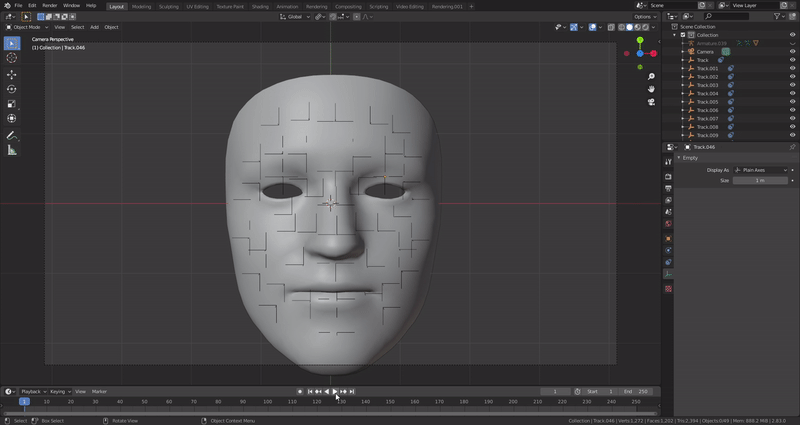

## About me

Bachelor’s in computer science and 3D programmer Specialist.

<!-- <x-model class="model" id="3dModel" src="models/Duck/Duck.gltf"></x-model> -->

### Education

**2013-2018**  Bachelor’s in computer science  _University of Granada_

### Experience

- #### On Going **Indra**

    Working as a software engineer creating airport simulation software. Written in C++
    and C#. Also I’ve been developing plugins for Autodesk Maya in C++ and Python.

    - Support and development of improvements in the internal modeling tool. Fixing
    some internal bugs and developing a new tool to create and assign atlas textures
    to models.

    - Plugin programming for Autodesk modeling software, Maya. Developing the
    functionality to dynamically generate geometry based on a proprietary file format, and tools and interfaces to help 3D artists to generate the extra elements
    of the airport.

    - Implementation of a new 3D tactical map synchronizing the company's own viewer tools with the .Net application to monitor pilot learning. In addition to implementing improvements and supporting the old 3D map developed in DirectX.

- #### 3 Month **Desarrollo-TIC**

    Support the applications made by the company for banks like Caja Rural de Granada
    and developing of a feature to automatically detect and translate the context of the
    webpage depending on the region using Symphony and PHP.

### Proyects

- **Facial capture.** Demo for animation using Blender software. In this demo you can animate a mesh of a face using a video as a reference thanks to a small python script to autodetect and position the bones needed to animate, as well as associate them with the mesh and apply the deformations
    
- **Degree’s final project.** Web application of personal organization. Implementation of API Rest and Front-End. Use of .NET Core, ReactJS
and Microsoft SQLServer technologies.

- **Roguelike game in unity.** Development of a 3D shooter game with
overhead view with a science fiction theme.

- **Unity Video Game Demo.** Small demo of a low poly video game in Unity. This demo is intended to show the use of motion scrips in Unity, the animation and transition of character animations and the application of shaders to the scene

<iframe width="100%" height="420"
src="https://youtu.be/zOb8UpVcIeY">
</iframe>

- **Android App and Web service.** Development of an Android App and Web service to improve accessibility, access to multimedia content and administer content for
MuseoCajaGranada. Responsible of programing the Web page and
restful API.

- **Development of an Augmented Reality App.** Augmented reality app for Android in unity that
allows to project 3D models of cards of the well-known board game
Magic The Gathering.

<iframe width="100%" height="420"
src="https://youtu.be/ODGyksC7RjU">
</iframe>

- **OpenGL X-Wing.** Developing an interactive program in order to understand the principles of OpenGL's geometry positioning and motion scenes. This program recreates an X-Wing from the Star Wars saga that can fly, shoot and eject a cute R2D2.
    
    

### Courses

- **2020**  WPF & XAML: Build 10 WPF applications (C#) in 2020  _Udemy_
- **2016**  Initiation to python3   _Academia T-Formación_
- **2018**  Shader Development from Scratch for Unity with Cg   _Udemy_
- **2018**  Level Design Master Class: All in One Complete Course   _Udemy_

### Skills

My coding Skills:
- C++
- C#
- OpenGL
- Unity
- Maya

My personal skills:
- Ability to work under pressure.
- Fast learning.
- Able to work as a team.
- Good organization.
- Languages: Spanish: Native, English: B1.

